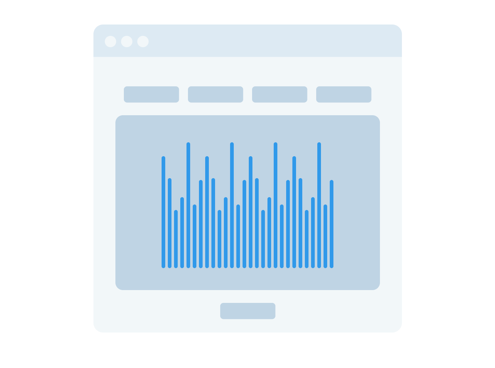

# Visualizer for Sorting Algorithms 

* the technologies you plan on using
## Tech used
React

* a description of the app
## Description 
In the past few weeks I've been learning a lot about different sorting algrorithms and how they work. This inspired me to make a sort visualizer tool. I would like to inlcude Merge Sort, Quick Sort, Heap Sort, Bubble Sort algorithms in this visualizer tool. This will help me understand these algorithms and also practice my front end engineering skills. 

* wireframes of the app

## MVP 
* at least one algorithm (MergeSort) working properly on the canvas
* sort button
* reshuffle button  

